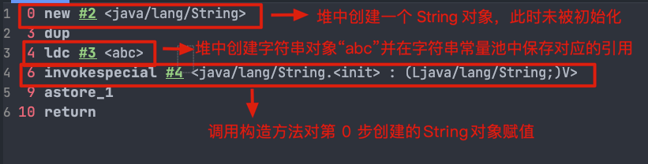
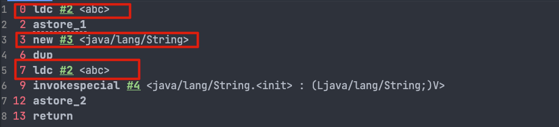

# 对象的相等和引用相等的区别

+ 对象的相等一般比较的是内存中存放的内容是否相等。
+ 引用相等一般比较的是他们指向的内存地址是否相等。

例子：

```java
String str1 = "hello";
String str2 = new String("hello");
String str3 = "hello";
// 使用 == 比较字符串的引用相等
System.out.println(str1 == str2);
System.out.println(str1 == str3);
// 使用 equals 方法比较字符串的相等
System.out.println(str1.equals(str2));
System.out.println(str1.equals(str3));
```

输出结果：

```java
false
true
true
true
```

可以看出：

+ str1 和 str2 不相等，而 str1 和 str3 相等。这是因为 == 运算符比较的是字符串的引用是否相等。
+ str1、 str2、str3 三者的内容都相等。这是因为equals 方法比较的是字符串的内容，即使这些字符串的对象引用不同，只要它们的内容相等，就认为它们是相等的。

# String、StringBuffer、StringBuilder的区别

区别主要在三个方面：可变性、线程安全性、性能

**可变性**

String是不可变的。

StringBuilder 与 StringBuffer 都继承自 AbstractStringBuilder 类，在 AbstractStringBuilder 中也是使用字符数组保存字符串，不过没有使用 final 和 private 关键字修饰，最关键的是这个 AbstractStringBuilder 类还提供了很多修改字符串的方法比如 append 方法。

**线程安全性**

String 中的对象是不可变的，也就可以理解为常量，线程安全。AbstractStringBuilder 是 StringBuilder 与 StringBuffer 的公共父类，定义了一些字符串的基本操作，如 expandCapacity、append、insert、indexOf 等公共方法。StringBuffer 对方法加了同步锁或者对调用的方法加了同步锁，所以是线程安全的。StringBuilder 并没有对方法进行加同步锁，所以是非线程安全的

**性能**

每次对 String 类型进行改变的时候，都会生成一个新的 String 对象，然后将指针指向新的 String 对象。StringBuffer 每次都会对 StringBuffer 对象本身进行操作，而不是生成新的对象并改变对象引用。相同情况下使用 StringBuilder 相比使用 StringBuffer 仅能获得 10%~15% 左右的性能提升，但却要冒多线程不安全的风险。

**总结**

1. 操作少量的数据:使用String
2. 单线程操作字符串缓冲区下操作大量数据: 适用 StringBuilder
3. 多线程操作字符串缓冲区下操作大量数据: 适用 StringBuffer

# String为什么是不可变的

1. 保存字符串的数组被 final 修饰且为私有的，并且String 类没有提供/暴露修改这个字符串的方法。
2. String 类被 final 修饰导致其不能被继承，进而避免了子类破坏 String 不可变。

# String s1 = new String("abc");这句话创建了几个字符串对象？

会创建一个或两个字符串对象。

1、如果字符串常量池中不存在字符串对象“abc”的引用，那么它将首先在字符串常量池中创建，然后在堆空间中创建，因此将创建总共 2 个字符串对象。

对于这行代码

```java
String s1 = new String("abc");
```

它对应的字节码文件：



ldc 命令用于判断字符串常量池中是否保存了对应的字符串对象的引用，如果保存了的话直接返回，如果没有保存的话，会在堆中创建对应的字符串对象并将该字符串对象的引用保存到字符串常量池中。

2、常量池有"abc"，则只会在堆中创建一个字符串对象"abc"。

示例代码：

```java
// 字符串常量池中已存在字符串对象“abc”的引用
String s1 = "abc";
// 下面这段代码只会在堆中创建 1 个字符串对象“abc”
String s2 = new String("abc");
```

对应字节码文件：



7 这个位置的 ldc 命令不会在堆中创建新的字符串对象“abc”，这是因为 0 这个位置已经执行了一次 ldc 命令，已经在堆中创建过一次字符串对象“abc”了。7 这个位置执行 ldc 命令会直接返回字符串常量池中字符串对象“abc”对应的引用。

# 泛型注意
**泛型作用**

使用泛型参数可以增强代码的可读性以及稳定性。  
编译器可以对泛型参数进行检测，并且通过泛型参数可以指定传入的对象类型。比如 ArrayList<Person> persons = new ArrayList<Person>() 这行代码就指明了该 ArrayList 对象只能传入 Person 对象，如果传入其他类型的对象就会报错。

**项目中哪里使用到了泛型**

+ 自定义接口通用返回结果：CommonResult<T> 通过参数 T 可根据具体的返回类型动态指定结果的数据类型。
+ 定义 Excel 处理类 ExcelUtil<T> 用于动态指定 Excel 导出的数据类型。
+ 构建集合工具类  

# 反射
## 什么是反射
反射是框架的灵魂，它赋予了我们在运行时分析类以及执行类中方法的能力。通过反射我们可以获取任意一个类的所有属性和方法，还可以调用这些方法和属性。
## 反射的优缺点
反射可以让我们的代码更加灵活、为各种框架提供开箱即用的功能提供了便利。 

不过，反射让我们在运行时有了分析操作类的能力的同时，也增加了安全问题，比如可以无视泛型参数的安全检查（泛型参数的安全检查发生在编译时）。另外，反射的性能也要稍差点，不过，对于框架来说实际是影响不大的。

## 反射的应用场景
像咱们平时大部分时候都是在写业务代码，很少会接触到直接使用反射机制的场景。但是！这并不代表反射没有用。相反，正是因为反射，你才能这么轻松地使用各种框架。像 Spring/Spring Boot、MyBatis 等等框架中都大量使用了反射机制。

**这些框架中也大量使用了动态代理，而动态代理的实现也依赖反射。**