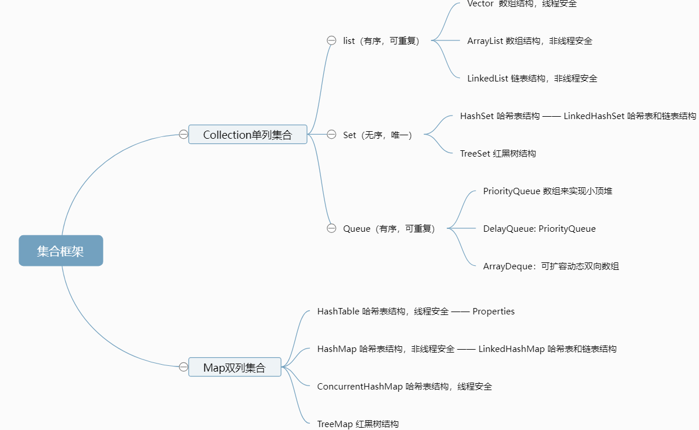

# 集合框架结构图



# 说说List,Set,Queue,Map四者的区别

+ List(对付顺序的好帮手): 存储的元素是有序的、可重复的。
+ Set(注重独一无二的性质): 存储的元素不可重复的。
+ Queue(实现排队功能的叫号机): 按特定的排队规则来确定先后顺序，存储的元素是有序的、可重复的。
+ Map(用 key 来搜索的专家): 使用键值对（key-value）存储，类似于数学上的函数 y=f(x)，"x" 代表 key，"y" 代表 value，key 是无序的、不可重复的，value 是无序的、可重复的，每个键最多映射到一个值

# 集合框架底层数据结构总结

**Collection接口下的**

1. **List**

+ ArrayList：数组。
+ Vector: 数组。
+ LinkedList：双向链表(JDK1.6 之前为循环链表，JDK1.7 取消了循环)。

2. **Set**

+ HashSet(无序，唯一): 基于 HashMap 实现的，底层采用 HashMap 来保存元素。
+ LinkedHashSet: LinkedHashSet 是 HashSet 的子类，并且其内部是通过 LinkedHashMap 来实现的。
+ TreeSet(有序，唯一): 红黑树(自平衡的排序二叉树)。

3. **Queue**

+ PriorityQueue: Object[] 数组来实现小顶堆。
+ DelayQueue:PriorityQueue。
+ ArrayDeque: 可扩容动态双向数组。

**Map接口下的**

+ HashMap：HashMap本来由“数组+链表”组成的数组是 HashMap 的主体，链表则是主要为了解决哈希冲突而存在的。Jdk1.8后HashMap使用“数组+红黑树”来解决哈希冲突，即当链表长度大于阈值（默认为8）时，将链表转化为红黑树，以减少搜索时间。
+ LinkedHashMap：LinkedHashMap 继承自 HashMap，也是由“数组+链表或红黑树”组成。另外，LinkedHashMap 在上面结构的基础上，增加了一条双向链表，使得上面的结构可以保持键值对的插入顺序。
+ Hashtable：数组+链表组成的，数组是 Hashtable 的主体，链表则是主要为了解决哈希冲突而存在的。
+ TreeMap：红黑树（自平衡的排序二叉树）。

# List

## ArrayList与普通Array的区别

+ ArrayList能扩容。
+ ArrayList 允许使用泛型来确保类型安全。
+ ArrayList 中只能存储对象。对于基本类型数据，需要使用其对应的包装类（如 Integer、Double 等）。Array 可以直接存储基本类型数据，也可以存储对象。
+ ArrayList 支持插入、删除、遍历等常见操作，并且提供了丰富的 API 操作方法，比如 add()、remove()等。
+ ArrayList创建时不需要指定大小，而Array创建时必须指定大小。

## ArrayList与LinkedList的区别

+ **底层数据结构：** ArrayList 是 Object 数组；LinkedList 底层使用的是 双向链表。
+ **插入和删除是否受元素位置的影响：**
  * ArrayList 采用数组存储，所以插入和删除元素的时间复杂度受元素位置的影响。 比如：执行add(E e)方法的时候， ArrayList 会默认在将指定的元素追加到此列表的末尾，这种情况时间复杂度就是 O(1)。但是如果要在指定位置 i 插入和删除元素的话（add(int index, E element)），时间复杂度就为 O(n)。因为在进行上述操作的时候集合中第 i 和第 i 个元素之后的(n-i)个元素都要执行向后位/向前移一位的操作。
  * LinkedList 采用链表存储，所以在头尾插入或者删除元素不受元素位置的影响（add(E e)、addFirst(E e)、addLast(E e)、removeFirst()、 removeLast()），时间复杂度为 O(1)，如果是要在指定位置 i 插入和删除元素的话（add(int index, E element)，remove(Object o),remove(int index)）， 时间复杂度为 O(n) ，因为需要先移动到指定位置再插入和删除。
+ **是否支持快速随机访问：** LinkedList 不支持高效的随机元素访问，而 ArrayList 是数组所以支持。快速随机访问就是通过元素的序号快速获取元素对象。
+ **内存空间占用：** ArrayList 的空间浪费主要体现在在 list 列表的结尾会预留一定的容量空间，而 LinkedList 的空间花费则体现在它的每一个元素都需要消耗比 ArrayList 更多的空间（因为要存放直接后继和直接前驱以及数据）。

# Set

## 比较 HashSet、LinkedHashSet 和 TreeSet 三者的异同

+ HashSet、LinkedHashSet 和 TreeSet 都是 Set 接口的实现类，都能保证元素唯一，并且都不是线程安全的。HashSet、LinkedHashSet 和 TreeSet 的主要区别在于底层数据结构不同。
+ HashSet 的底层数据结构是哈希表（基于 HashMap 实现）。LinkedHashSet 的底层数据结构是链表和哈希表，元素的插入和取出顺序满足 FIFO。TreeSet 底层数据结构是红黑树，元素是有序的，排序的方式有自然排序和定制排序。
+ 底层数据结构不同又导致这三者的应用场景不同。HashSet 用于不需要保证元素插入和取出顺序的场景，LinkedHashSet 用于保证元素的插入和取出顺序满足 FIFO 的场景，TreeSet 用于支持对元素自定义排序规则的场景

# Map

Map内容以看javaguide原文为主：
https://javaguide.cn/java/collection/java-collection-questions-02.html#map-%E9%87%8D%E8%A6%81

## HashMap底层实现

HashMap是基于哈希表实现的，底层数据结构是数组+链表或红黑树，使用哈希函数将键映射为索引，以实现快速的插入、删除和查找操作。

具体的说，哈希函数会将键值对的键映射为一个整数，这个整数可以作为数组的索引。当不同的键值通过哈希函数映射到同一位置时，会产生哈希冲突，这时HashMap使用链表来存储这些键值对，当链表长度超过阈值(8)时，链表会被转化为红黑树。

## 如何遍历HashMap

1、遍历键值对：使用entrySet方法获取Map.Entry的Set视图，然后使用for-each循环遍历Set，再通过Map.Entry的getKey和getValue方法获取键和值。

~~~java
Map<String,Integer> map=new HashMap<>();
// 添加键值对
map.put("A",1);
map.put("B",2);
map.put("C",3);
// 遍历键值对
for(Map.Entry<String,Integer> entry:map.entrySet()) {
    String key=entry.getKey();
    Integer value=entry.getValue();
    System.out.println(key+":"+value);
}
~~~

2、遍历键或值：使用keySet或values方法获取键或值的集合视图，然后使用for-each循环遍历集合

~~~java
Map<String,Integer> map=new HashMap<>();
// 添加键值对
map.put("A",1);
map.put("B",2);
map.put("C",3);
// 遍历键
for(String key:map.keySet()) {
    System.out.println(key);
}

// 遍历值
for(Integer value:map.values()) {
    System.out.println(value);
}
~~~

## HashMap插入元素的底层实现

1. 计算键的哈希值：通过hashCode方法计算出对象的哈希值。
2. 计算出哈希地址：HashMap会根据键的哈希值和哈希表的大小，来通过哈希函数，计算出关键字的哈希地址。
3. 处理哈希冲突：当两个键的哈希值相同时，它们就被映射到同一个位置上，这是哈希冲突。HashMap会使用链表来解决哈希冲突，以链表的形式连接起来。在java8之后，当链表的长度超过阙值（默认为8）时，HashMap会将链表转化为红黑树，以提高查询效率。
4. 扩容：当HashMap中的元素数量超过了负载因子（0.75）与哈希表大小的乘积时，HashMap会自动进行扩容操作。

## HashMap扩容细节

当HashMap中的元素达到阙值时，就需要进行扩容操作，以保证HashMap的性能。

1、创建一个新的数组，其长度为原数组的两倍。  
2、将原数组中的元素重新分配到新数组中，重新计算它们在新数组中的位置。  
3、将新数组设置为HashMap的数组，用于存储键值对。  
4、将原数组的引用设置为null，以便进行垃圾回收。

## 拉链法的缺点

1、内存占用较大：由于每个桶中都需要存储一个链表，当哈希表中存储元素较少时，可能会浪费很多内存空间

2、链表长度不均衡：由于哈希冲突不可避免，可能会导致某些链表长度过长，从而影响哈希表性能。

3、缓存不友好：由于链表中节点在内存中不是连续存储的，所以缓存性能较差

## ConcurrentHashMap保证线程安全

**优化策略：**

**1.锁粒度的控制**

> HashTable直接在方法上加synchronized,相当于是对this加锁（即相当于针对哈希表对象加锁），一个哈希表只有一个锁，多个线程无论怎样操作这个哈希表，都会产生锁冲突

ConcurrentHashMap的每个哈希桶都有自己的锁，不同的线程可以同时访问不同的哈希桶，从而实现并发的读写操作，性能也就大大提高了，而且不会相互阻塞。

**2.只给写操作加锁，没有给读操作加锁**

ConcurrentHashMap允许多个线程同时进行读操作，而不需要加锁。这是因为在读操作中，不涉及数据修改，因此不会引起线程安全问题，这样设计可以提高并发性能，运行多个线程同时读取数据。

**3.充分利用CAS的特性**

ConcurrentHashMap提供了一些原子性操作的方法，如putIfAbsent()、remove()等，这些方法在执行时会进行CAS的原子性检查和修改操作，保证多个线程同时执行这些操作时的正确性。

**4.对于扩容操作进行了特殊的优化**

在HashTable扩容时，是发现了负载因子超过了阈值，需要申请一个更大的数组，然后把之前旧的数据给搬运到新的数组上（开销很大）

ConcurrentHashMap在扩容的时候，不是直接一次性完成搬运了，而是旧的和新的会同时存在一段时间，每次进行哈希表的操作，都会把旧的内存上的元素搬运一部分到新的空间上，直到最终搬运完成，此时再释放旧的空间。

## HashMap 和 Hashtable 的区别

+ **线程是否安全：** HashMap是线程不安全的，Hashtable是线程安全的，因为Hashtable内部的方法基本都通过synchronized修饰。（可使用ConcurrentHashMap保证线程安全）
+ **效率：** 因为线程安全的问题，HashMap 要比 Hashtable 效率高一点。另外，Hashtable 基本被淘汰，不要在代码中使用它；
+ **对 Null key 和 Null value 的支持：** HashMap 可以存储 null 的 key 和 value，但 null 作为键只能有一个，null 作为值可以有多个；Hashtable 不允许有 null 键和 null 值，否则会抛出 NullPointerException。
+ **初始容量大小和每次扩充容量大小的不同：** ① 创建时如果不指定容量初始值，Hashtable 默认的初始大小为 11，之后每次扩充，容量变为原来的 2n+1。HashMap 默认的初始化大小为 16。之后每次扩充，容量变为原来的 2 倍。② 创建时如果给定了容量初始值，那么 Hashtable 会直接使用你给定的大小，而 HashMap 会将其扩充为 2 的幂次方大小。也就是说 HashMap 总是使用 2 的幂作为哈希表的大小。
+ **底层数据结构：** JDK1.8 以后的 HashMap 在解决哈希冲突时有了较大的变化，当链表长度大于阈值（默认为 8）时，将链表转化为红黑树（将链表转换成红黑树前会判断，如果当前数组的长度小于 64，那么会选择先进行数组扩容，而不是转换为红黑树），以减少搜索时间。Hashtable 没有这样的机制。

## HashMap与HashSet区别

HashSet 底层就是基于 HashMap 实现的。

|              HsahMap              |                                                     HashSet                                                     |
| :--------------------------------: | :--------------------------------------------------------------------------------------------------------------: |
|           实现了Map接口           |                                                   实现Set接口                                                   |
|             存储键值对             |                                                    仅存储对象                                                    |
|      调用Put()向map中添加元素      |                                           调用add()方法向Set中添加元素                                           |
| HashMap 使用键（Key）计算 hashcode | HashSet 使用成员对象来计算 hashcode 值，对于两个对象来说 hashcode 可能相同，所以equals()方法用来判断对象的相等性 |

## HashMap与TreeMap的区别

TreeMap 和HashMap 都继承自AbstractMap ，但是需要注意的是TreeMap它还实现了NavigableMap接口和SortedMap 接口。


实现 NavigableMap 接口让 TreeMap 有了对集合内元素的搜索的能力。实现SortedMap接口让 TreeMap 有了对集合中的元素根据键排序的能力。默认是按 key 的升序排序，不过我们也可以指定排序的比较器。示例代码如下：

```java
public class Person {
    private Integer age;

    public Person(Integer age) {
        this.age = age;
    }

    public Integer getAge() {
        return age;
    }


    public static void main(String[] args) {
        TreeMap<Person, String> treeMap = new TreeMap<>((person1, person2) -> {
                int num = person1.getAge() - person2.getAge();
                return Integer.compare(num, 0);
        });
  
        treeMap.put(new Person(3), "person1");
        treeMap.put(new Person(18), "person2");
        treeMap.put(new Person(35), "person3");
        treeMap.put(new Person(16), "person4");
        treeMap.entrySet().stream().forEach(personStringEntry -> {
            System.out.println(personStringEntry.getValue());
        });
    }
}
```

输出：

```
person1
person4
person2
person3
```

**综上，相比于HashMap来说，TreeMap主要多了对集合中的元素根据键排序的能力，以及对集合内元素的搜索的能力。**（搜索能力建立在底层数据结构红黑树的基础之上）

## HashMap 为什么线程不安全？

JDK 1.8 后，在 HashMap 中，多个键值对可能会被分配到同一个桶（bucket），并以链表或红黑树的形式存储。多个线程对 HashMap 的 put 操作会导致线程不安全，具体来说会 **有数据覆盖的风险** 。

举个例子：

+ 两个线程 1,2 同时进行 put 操作，并且发生了哈希冲突（hash 函数计算出的插入下标是相同的）。
+ 不同的线程可能在不同的时间片获得 CPU 执行的机会，当前线程 1 执行完哈希冲突判断后，由于时间片耗尽挂起。线程 2 先完成了插入操作。
+ 随后，线程 1 获得时间片，由于之前已经进行过 hash 碰撞的判断，所以此时会直接进行插入，这就导致线程 2 插入的数据被线程 1 覆盖了。

```java
public V put(K key, V value) {
    return putVal(hash(key), key, value, false, true);
}

final V putVal(int hash, K key, V value, boolean onlyIfAbsent,
                   boolean evict) {
    // ...
    // 判断是否出现 hash 碰撞
    // (n - 1) & hash 确定元素存放在哪个桶中，桶为空，新生成结点放入桶中(此时，这个结点是放在数组中)
    if ((p = tab[i = (n - 1) & hash]) == null)
        tab[i] = newNode(hash, key, value, null);
    // 桶中已经存在元素（处理hash冲突）
    else {
    // ...
}
```

还有一种情况是这两个线程同时 put 操作导致 size 的值不正确，进而导致数据覆盖的问题：

1. 线程 1 执行 if(++size > threshold) 判断时，假设获得 size 的值为 10，由于时间片耗尽挂起。
2. 线程 2 也执行 if(++size > threshold) 判断，获得 size 的值也为 10，并将元素插入到该桶位中，并将 size 的值更新为 11。
3. 随后，线程 1 获得时间片，它也将元素放入桶位中，并将 size 的值更新为 11。
4. 线程 1、2 都执行了一次 put 操作，但是 size 的值只增加了 1，也就导致实际上只有一个元素被添加到了 HashMap 中。

```java
public V put(K key, V value) {
    return putVal(hash(key), key, value, false, true);
}

final V putVal(int hash, K key, V value, boolean onlyIfAbsent,
                   boolean evict) {
    // ...
    // 实际大小大于阈值则扩容
    if (++size > threshold)
        resize();
    // 插入后回调
    afterNodeInsertion(evict);
    return null;
}
```
