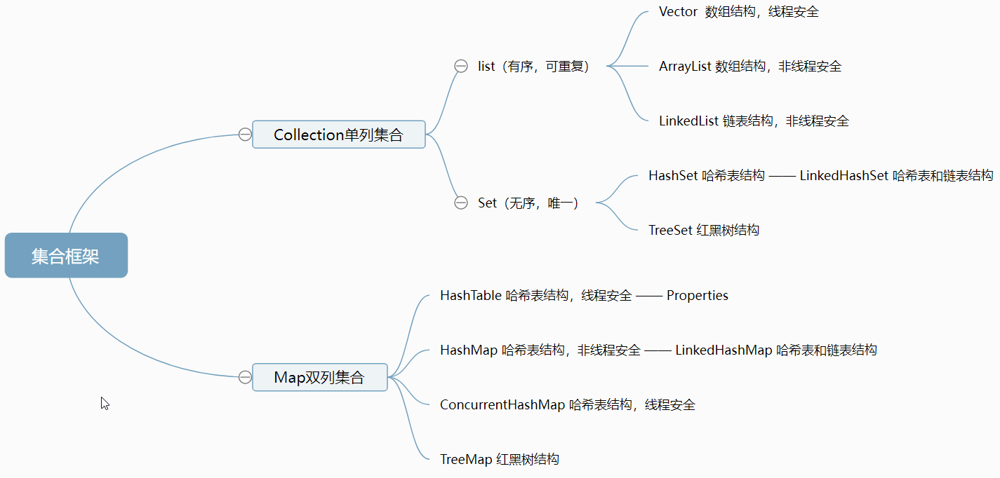

# 集合框架结构图

# 说说List,Set,Queue,Map四者的区别
+ List(对付顺序的好帮手): 存储的元素是有序的、可重复的。
+ Set(注重独一无二的性质): 存储的元素不可重复的。
+ Queue(实现排队功能的叫号机): 按特定的排队规则来确定先后顺序，存储的元素是有序的、可重复的。
+ Map(用 key 来搜索的专家): 使用键值对（key-value）存储，类似于数学上的函数 y=f(x)，"x" 代表 key，"y" 代表 value，key 是无序的、不可重复的，value 是无序的、可重复的，每个键最多映射到一个值

# 集合框架底层数据结构总结
**Collection接口下的**
1. **List**
+ ArrayList：数组。
+ Vector: 数组。
+ LinkedList：双向链表(JDK1.6 之前为循环链表，JDK1.7 取消了循环)。

2. **Set**
+ HashSet(无序，唯一): 基于 HashMap 实现的，底层采用 HashMap 来保存元素。
+ LinkedHashSet: LinkedHashSet 是 HashSet 的子类，并且其内部是通过 LinkedHashMap 来实现的。
+ TreeSet(有序，唯一): 红黑树(自平衡的排序二叉树)。

3. **Queue**
+ PriorityQueue: Object[] 数组来实现小顶堆。
+ DelayQueue:PriorityQueue。
+ ArrayDeque: 可扩容动态双向数组。

**Map接口下的**
+ HashMap：HashMap本来由“数组+链表”组成的数组是 HashMap 的主体，链表则是主要为了解决哈希冲突而存在的。Jdk1.8后HashMap使用“数组+红黑树”来解决哈希冲突，即当链表长度大于阈值（默认为8）时，将链表转化为红黑树，以减少搜索时间。
+ LinkedHashMap：LinkedHashMap 继承自 HashMap，也是由“数组+链表或红黑树”组成。另外，LinkedHashMap 在上面结构的基础上，增加了一条双向链表，使得上面的结构可以保持键值对的插入顺序。
+ Hashtable：数组+链表组成的，数组是 Hashtable 的主体，链表则是主要为了解决哈希冲突而存在的。
+ TreeMap：红黑树（自平衡的排序二叉树）。

# List
## ArrayList与普通Array的区别
+ ArrayList能扩容。
+ ArrayList 允许使用泛型来确保类型安全。
+ ArrayList 中只能存储对象。对于基本类型数据，需要使用其对应的包装类（如 Integer、Double 等）。Array 可以直接存储基本类型数据，也可以存储对象。
+ ArrayList 支持插入、删除、遍历等常见操作，并且提供了丰富的 API 操作方法，比如 add()、remove()等。
+ ArrayList创建时不需要指定大小，而Array创建时必须指定大小。

## ArrayList与LinkedList的区别
+ **底层数据结构：** ArrayList 是 Object 数组；LinkedList 底层使用的是 双向链表。
+ **插入和删除是否受元素位置的影响：**
  * ArrayList 采用数组存储，所以插入和删除元素的时间复杂度受元素位置的影响。 比如：执行add(E e)方法的时候， ArrayList 会默认在将指定的元素追加到此列表的末尾，这种情况时间复杂度就是 O(1)。但是如果要在指定位置 i 插入和删除元素的话（add(int index, E element)），时间复杂度就为 O(n)。因为在进行上述操作的时候集合中第 i 和第 i 个元素之后的(n-i)个元素都要执行向后位/向前移一位的操作。
  * LinkedList 采用链表存储，所以在头尾插入或者删除元素不受元素位置的影响（add(E e)、addFirst(E e)、addLast(E e)、removeFirst()、 removeLast()），时间复杂度为 O(1)，如果是要在指定位置 i 插入和删除元素的话（add(int index, E element)，remove(Object o),remove(int index)）， 时间复杂度为 O(n) ，因为需要先移动到指定位置再插入和删除。
+ **是否支持快速随机访问：** LinkedList 不支持高效的随机元素访问，而 ArrayList 是数组所以支持。快速随机访问就是通过元素的序号快速获取元素对象。
+ **内存空间占用：** ArrayList 的空间浪费主要体现在在 list 列表的结尾会预留一定的容量空间，而 LinkedList 的空间花费则体现在它的每一个元素都需要消耗比 ArrayList 更多的空间（因为要存放直接后继和直接前驱以及数据）。
