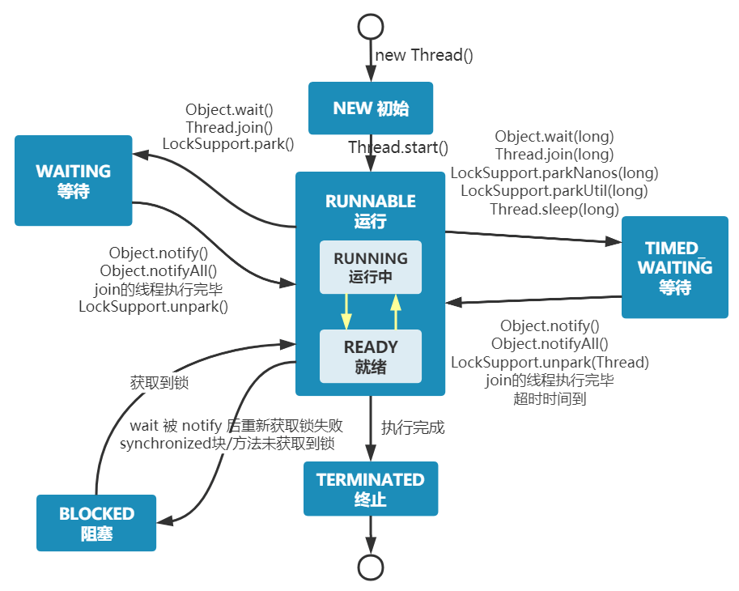
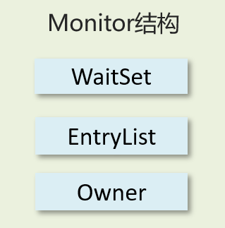
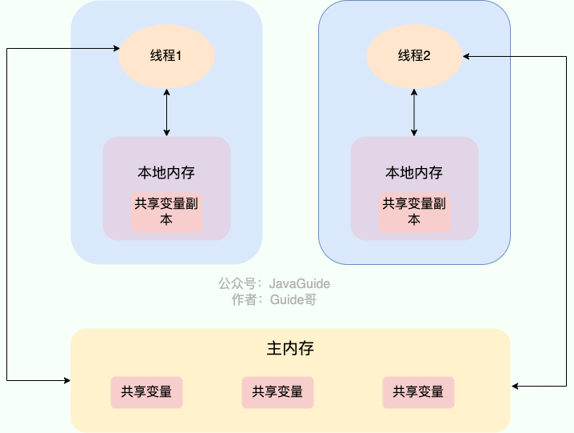
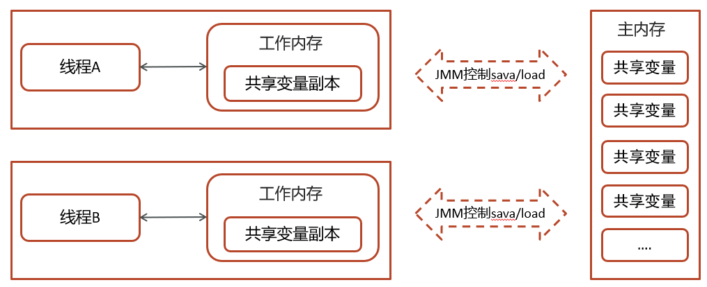
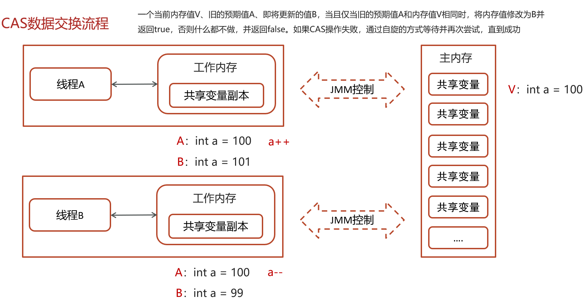

# 线程与进程的区别和联系

+ 进程比线程更轻量，创建更快、销毁也更快。
+ 直观理解：进程是正在运行程序的实例，进程中包含了线程，每个线程执行不同的任务。
+ 系统角度：进程是操作系统资源分配的基本单位，线程是操作系统调度执行的基本单位。
+ 不同的进程使用不同的内存空间，在当前进程下的所有线程可以共享内存空间（例如共同使用同一个变量）。

# 并行与并发有什么区别

现在都是多核CPU，在多核CPU下

+ 并发是同一时间应对多件事情的能力，多个线程轮流使用一个或多个CPU
+ 并行是同一时间动手做多件事情的能力，4核CPU同时执行4个线程

# 创建线程的方式

+ 继承Thread类
+ 实现runnable接口
+ 实现Callable接口
+ 线程池创建线程(项目中使用方式)

追问：

1. **使用runnable和callable都可以创建线程，它们有什么区别呢？**

答：

+ Runnable 接口run方法没有返回值
+ Callable接口call方法有返回值，是个泛型，和Future、FutureTask配合可以用来获取异步执行的结果
+ Callable接口的call()方法允许抛出异常；而Runnable接口的run()方法的异常只能在内部消化，不能继续上抛。

```java
// 使用Runnable
Runnable myRunnable = () -> {
    // 任务逻辑
    System.out.println("Runnable task");
};

// 使用Callable
Callable<String> myCallable = () -> {
    // 任务逻辑
    return "Callable task";
};
```

2. **线程的run()和start()有什么区别？**

答：

+ run()是一个封装了要被执行代码的普通方法，直接调用run方法是不能启动线程的，可以被调用多次。
+ 而start方法的底层是由JVM调用start0方法，来开启线程，通过该线程调用run方法执行run方法中所定义的逻辑代码，只能被调用一次。

# 线程间的状态



+ `new Thread()`后，线程首先进入 **New(初始)** 状态，调用 `start()`后开始运行，线程这时候处于 **Ready(就绪)** 状态，当Ready的线程获得CPU执行权后就处于 **Running(运行)** 状态，执行完成后进入 **Terminated(终止状态)**。这是一个大致的流程，当线程处于 **Runnable(可运行状态)** 时，会通过执行方法变成其它状态。
+ 当线程执行 `wait()`方法之后，线程进入 **Waiting(等待)** 状态，进入等待状态的线程需要依靠其它线程的通知才能够返回到运行状态。
+ **Time_Waiting(超时等待)** 状态相当于在等待的基础上增加了超时限制，比如通过 `sleep(long millis)`方法或 `wait(long millis)`方法可以将线程置于Time_Waiting状态。当超时时间结束后，线程将会返回到Runnable状态。
+ 当线程进入 `synchronized`方法/代码块，锁被其它线程占有，这时线程进入 **Blocked(阻塞)** 状态。

# wait和sleep方法的区别

主要在于锁特性的不同：

+ wait方法的调用必须先获取wait对象的锁，对应了wait与synchronized是配套使用的，而sleep则无此限制。
+ wait方法执行后会释放对象锁，允许其它线程获得该对象锁（我放弃CPU，但你们还可以用）
+ sleep如果在synchronized代码块中执行，并不会释放对象锁（我放弃CPU，你们也用不了）

# synchronized的底层原理

Synchronized【对象锁】采用互斥的方式让同一时刻至多只有一个线程能持有【对象锁】，其它线程再想获取这个【对象锁】时就会阻塞住。

Synchronized的底层是**Monitor。** 线程获得锁需要使用对象（锁）关联monitor。



+ Owner：存储当前获取锁的线程的，只能有一个线程可以获取
+ EntryList：关联没有抢到锁的线程，处于Blocked状态的线程
+ WaitSet：关联调用了wait方法的线程，处于Waiting状态的线程

# volatile关键字的作用

1. **保证线程间的可见性**
   用volatile修饰共享变量，能够防止编译器等优化发生，让一个线程对共享变量的修改对另一个线程可见。如果我们将变量声明为 **`volatile`** ，这就指示 JVM，这个变量是共享且不稳定的，每次使用它都到主存中进行读取。

   
2. **禁止指令重排序**
   如果我们将变量声明为 **`volatile`** ，在对这个变量进行读写操作的时候，会通过插入特定的 **内存屏障** 的方式来禁止指令重排序。

# 浅谈JMM（java内存模型）

Java内存模型，定义了共享内存中多线程程序读写操作的行为规范，通过这些规则来规范对内存的读写操作从而保证指令的正确性。



JMM把内存分为两块，一块是私有线程的工作区域（工作内存），一块是所有线程的共享区域（主内存）。

线程跟线程之间是相互隔离，线程跟线程交互需要通过主内存。

# 浅谈CAS

CAS的全称是： Compare And Swap(比较再交换)，它体现的一种乐观锁的思想，在无锁情况下保证线程操作共享数据的原子性。



一个当前内存值V、旧的预期值A、即将更新的值B，当且仅当旧的预期值A和内存值V相同时，将内存值修改为B并返回true，否则什么都不做，并返回false。如果CAS操作失败，通过自旋的方式等待并再次尝试，直到成功。
