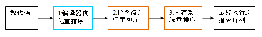

# java并发

选自@pdai,原文链接：https://pdai.tech/md/java/thread/java-thread-x-theorty.html

# 为什么需要多线程

CPU、内存、I/O 设备的速度是有极大差异的，为了合理利用 CPU 的高性能，平衡这三者的速度差异，CPU、操作系统、编译程序都做了贡献，具体如下：

+ CPU 增加了缓存，以均衡与内存的速度差异；// 导致 **可见性** 问题
+ 操作系统增加了进程、线程，以分时复用 CPU，进而均衡 CPU 与 I/O 设备的速度差异；// 导致 **原子性** 问题
+ 编译程序优化指令执行次序，使得缓存能够得到更加合理地利用。// 导致 **有序性** 问题

# 为什么会出现并发问题

如果多个线程对同一个共享数据进行访问而不采取同步操作的话，那么操作的结果是不一致的。比如 1000 个线程同时对一个变量执行自增操作，操作结束之后它的值有可能小于 1000，这就造成了线程不安全问题。
并发出现问题的根源：并发三要素：可见性、原子性、有序性。

## 可见性：CPU缓存引起

可见性：一个线程对共享变量的修改，另外一个线程能够立刻看到。

举例说明：

```java
//线程1执行的代码
int i = 0;
i = 10;

//线程2执行的代码
j = i;
```

假若执行线程1的是CPU1，执行线程2的是CPU2。当线程1执行 i=10 这句时，会先把i的初始值加载到CPU1的高速缓存中，然后赋值为10，那么在CPU1的高速缓存当中i的值变为10了，却没有立即写入到主存当中。

此时线程2执行 j = i，它会先去主存读取i的值并加载到CPU2的缓存当中，注意此时内存当中i的值还是0，那么就会使得j的值为0，而不是10.

这就是可见性问题，线程1对变量i修改了之后，线程2没有立即看到线程1修改的值。

## 原子性：分时复用引起

原子性：即一个操作或者多个操作 要么全部执行并且执行的过程不会被任何因素打断，要么就都不执行。
举例说明：
对于 `i += 1` 这个简单的操作， 需要三条 CPU 指令：

1. 将变量 i 从内存读取到 CPU寄存器；
2. 在CPU寄存器中执行 i + 1 操作；
3. 将最后的结果i写入内存（缓存机制导致可能写入的是 CPU 缓存而不是内存）。

由于CPU分时复用（线程切换）的存在，线程1执行了第一条指令后，就切换到线程2执行，假如线程2执行了这三条指令后，再切换会线程1执行后续两条指令，将造成最后写到内存中的i值是2而不是3。

## 有序性：重排序引起

有序性：即程序执行的顺序按照代码的先后顺序执行。

```java
int i = 0;          
boolean flag = false;
i = 1;                //语句1  
flag = true;          //语句2
```

从代码顺序上看，语句1是在语句2前面的，那么JVM在真正执行这段代码的时候会保证语句1一定会在语句2前面执行吗? 不一定，为什么呢? 这里可能会发生指令重排序（Instruction Reorder）。

在执行程序时为了提高性能，编译器和处理器常常会对指令做重排序。重排序分三种类型：

+ 编译器优化的重排序。编译器在不改变单线程程序语义的前提下，可以重新安排语句的执行顺序。
+ 指令级并行的重排序。现代处理器采用了指令级并行技术（Instruction-Level Parallelism， ILP）来将多条指令重叠执行。如果不存在数据依赖性，处理器可以改变语句对应机器指令的执行顺序。
+ 内存系统的重排序。由于处理器使用缓存和读 / 写缓冲区，这使得加载和存储操作看上去可能是在乱序执行。

从 java 源代码到最终实际执行的指令序列，会分别经历下面三种重排序：



# JAVA是怎么解决并发问题的: JMM(Java内存模型)
